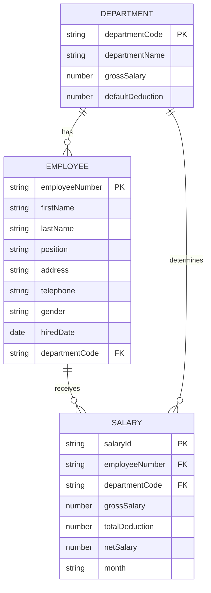

# SmartPark EPMS Entity Relationship Design

## Entities

### Department

- **Primary key:** `departmentCode`
- Attributes: `departmentCode`, `departmentName`, `grossSalary`, `defaultDeduction`

### Employee

- **Primary key:** `employeeNumber`
- **Foreign key:** `departmentCode` references `Department.departmentCode`
- Attributes: `employeeNumber`, `firstName`, `lastName`, `position`, `address`, `telephone`, `gender`, `hiredDate`, `departmentCode`

### Salary

- **Primary key:** `salaryId`
- **Foreign keys:** `employeeNumber` references `Employee.employeeNumber`, `departmentCode` references `Department.departmentCode`
- Attributes: `salaryId`, `employeeNumber`, `departmentCode`, `grossSalary`, `totalDeduction`, `netSalary`, `month`
- Constraint: one employee should have only one salary record per month.

## Relationships and Cardinalities

## Default Department Payroll Data

| Department Code | Department Name | Gross Salary | Total Deduction |
| --- | --- | ---: | ---: |
| CW | Carwash | 300,000 RWF | 20,000 RWF |
| ST | Stock | 200,000 RWF | 5,000 RWF |
| MC | Mechanic | 450,000 RWF | 40,000 RWF |
| ADMS | Administration Staff | 600,000 RWF | 70,000 RWF |

## Implementation Notes

- The backend connects to MongoDB database `EPMS` using `MONGODB_URI`.
- If local MongoDB is unavailable during development, the API falls back to an in-memory store so the interface can still be tested.
- The salary form performs retrieve, update, and delete operations as required.
- Monthly payroll reports return `firstName`, `lastName`, `position`, `department`, and `netSalary`.
